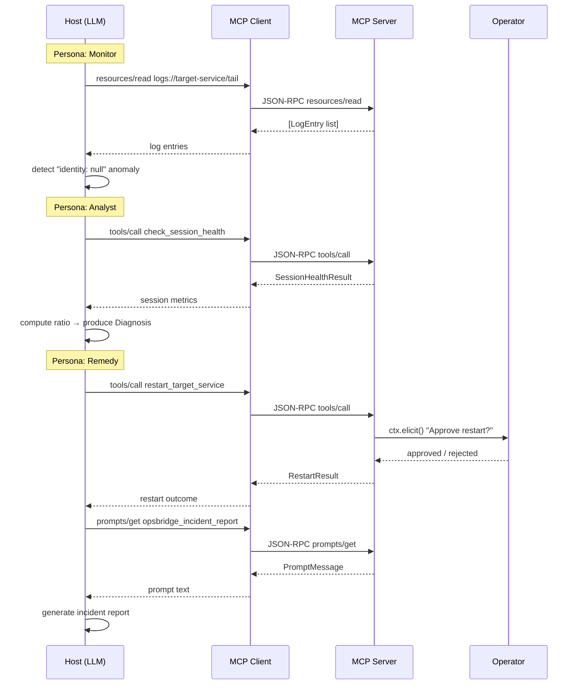

# Design Document: OpsBridge MCP Server

## Overview

OpsBridge is a single-process Python MCP server that demonstrates the three-layer Model Context Protocol architecture using `stdio` transport. It simulates a cloud operations scenario where three agent roles — Monitor, Analyst, and Remedy — collaborate to detect, diagnose, and remediate a session null-identity error in a mock microservice.

The key architectural insight is that all three roles are **not separate processes**. They are logical personas orchestrated by the Host (Claude Desktop or Cursor) via system prompt instructions. The MCP server exposes the primitives (Resources, Tools, Prompts) that each persona consumes. The Host LLM decides which primitive to call next based on the current persona and the data it has received.

This design eliminates the N×M integration problem: instead of each agent role implementing custom connectors to every service, all roles consume a single MCP interface. Swapping the underlying service (e.g., replacing mock logs with CloudWatch) requires changing only the server implementation, not any agent logic.

### Scope

- `stdio` transport only (no auth, no HTTP)
- All state is in-memory (`MOCK_STATE` dict)
- No real infrastructure dependencies
- Single Python file for server logic, with supporting modules for models, state, and prompts

### Out of Scope (Production Roadmap)

See the Production Roadmap section for what each mock component maps to in production.

---

## Architecture

### Three-Layer MCP Architecture

```
┌─────────────────────────────────────────────────────────────────┐
│  HOST APPLICATION (Claude Desktop / Cursor)                     │
│                                                                 │
│  System Prompt defines three personas:                          │
│    1. Monitor  → reads logs Resource, detects anomalies         │
│    2. Analyst  → calls check_session_health, produces Diagnosis │
│    3. Remedy   → calls restart_target_service (with elicitation)│
│                                                                 │
│  Orchestration: Host LLM switches persona based on data flow    │
└────────────────────────┬────────────────────────────────────────┘
                         │  JSON-RPC over stdio
                         ▼
┌─────────────────────────────────────────────────────────────────┐
│  MCP CLIENT (Python MCP SDK)                                    │
│                                                                 │
│  - Negotiates capabilities with server                          │
│  - Serializes/deserializes JSON-RPC messages                    │
│  - Routes resources/read, tools/call, prompts/get requests      │
│  - Handles elicitation response lifecycle                       │
└────────────────────────┬────────────────────────────────────────┘
                         │  stdio (stdin/stdout)
                         ▼
┌─────────────────────────────────────────────────────────────────┐
│  MCP SERVER (opsbridge/server.py)                               │
│                                                                 │
│  ├── Resource:  logs://{service_name}/tail                      │
│  │     Returns last N LogEntry objects from MOCK_STATE          │
│  │                                                              │
│  ├── Tool:      check_session_health                            │
│  │     Returns SessionHealthResult from MOCK_STATE              │
│  │                                                              │
│  ├── Tool:      restart_target_service                          │
│  │     Calls ctx.elicit() → sleep(1) → RestartResult           │
│  │                                                              │
│  └── Prompt:    opsbridge_incident_report                       │
│        Returns PromptMessage for incident report generation     │
│                                                                 │
│  All handlers emit structured JSON logs to stderr               │
└─────────────────────────────────────────────────────────────────┘
```

### Agent Flow Sequence

```
Host (Monitor persona)
  │
  ├─► resources/read  logs://target-service/tail
  │       └── Server returns [LogEntry, ...]
  │
  │   [LLM detects "Aborting session for identity: null"]
  │
Host (Analyst persona)
  │
  ├─► tools/call  check_session_health
  │       └── Server returns SessionHealthResult
  │
  │   [LLM computes error ratio, produces Diagnosis]
  │
Host (Remedy persona)
  │
  ├─► tools/call  restart_target_service { service_name: "target-service" }
  │       └── Server calls ctx.elicit()
  │               │
  │               ├── Operator APPROVES
  │               │       └── sleep(1) → RestartResult(status="simulated_complete")
  │               │
  │               └── Operator REJECTS
  │                       └── RestartResult(status="rejected")
  │
  ├─► prompts/get  opsbridge_incident_report
  │       └── Server returns PromptMessage
  │
  └── LLM generates final incident report
```

### Mermaid Sequence Diagram



---

## Components and Interfaces

### File Structure

```
opsbridge/
├── server.py              # MCP server: registers all primitives, runs stdio loop
├── models.py              # Pydantic data models for all inputs/outputs
├── mock_state.py          # MOCK_STATE dict + accessor helper functions
├── prompts.py             # opsbridge_incident_report prompt definition
└── scripts/
    └── run_mcp_local.py   # Entry point for Claude Desktop / uv invocation
```

### server.py — Responsibilities

- Instantiates the `mcp.Server` instance
- Registers the `logs://{service_name}/tail` resource handler
- Registers `check_session_health` and `restart_target_service` tool handlers
- Registers `opsbridge_incident_report` prompt handler
- Runs the stdio event loop via `mcp.run_stdio()`
- Emits structured JSON logs to `sys.stderr` on every primitive invocation

### mock_state.py — Responsibilities

- Defines `MOCK_STATE` as a module-level dict (single source of truth for demo state)
- Exposes typed accessor functions: `get_logs(service_name)`, `get_session_cache()`
- Accessor functions return empty/zero-value defaults when keys are absent

### models.py — Responsibilities

- Defines all Pydantic `BaseModel` subclasses
- No business logic — pure data shape definitions

### prompts.py — Responsibilities

- Defines the `build_incident_report_prompt(service_name, error_pattern, diagnosis_summary)` function
- Returns a `mcp.types.PromptMessage` object

### scripts/run_mcp_local.py — Responsibilities

- Thin entry point: imports `server` and calls `server.main()`
- Exists so Claude Desktop config can point `uv run` at a stable path

### Claude Desktop Configuration

```json
{
  "mcpServers": {
    "opsbridge": {
      "command": "uv",
      "args": [
        "--directory",
        "/absolute/path/to/opsbridge",
        "run",
        "scripts/run_mcp_local.py"
      ],
      "env": {
        "ENVIRONMENT": "local"
      }
    }
  }
}
```

---

## Data Models

All models are defined in `models.py` using Pydantic v2.

### LogEntry

Represents a single line from the mock log stream.

```python
class LogEntry(BaseModel):
    timestamp: str          # ISO 8601 string, e.g. "2025-01-15T10:23:01Z"
    level: str              # "ERROR" | "INFO" | "WARN" | "DEBUG"
    message: str            # Raw log message text
    transaction_id: Optional[str] = None  # Correlation ID, may be absent
```

### SessionHealthResult

Returned by `check_session_health`. Maps directly to `MOCK_STATE["session_cache"]`.

```python
class SessionHealthResult(BaseModel):
    used_keys: int          # Number of keys currently in cache
    capacity: int           # Maximum key capacity
    eviction_policy: str    # Redis eviction policy string, e.g. "allkeys-lru"
```

### RestartRequest

Input schema for `restart_target_service`.

```python
class RestartRequest(BaseModel):
    service_name: str       # Identifier of the service to restart
```

### RestartResult

Output of `restart_target_service` on both approval and rejection paths.

```python
class RestartResult(BaseModel):
    service_name: str
    restart_timestamp: str  # ISO 8601 timestamp of when restart was simulated
    status: str             # "simulated_complete" | "rejected" | "timeout"
```

### Diagnosis

Produced by the Analyst persona. Passed to the Remedy persona and referenced in the incident report prompt.

```python
class Diagnosis(BaseModel):
    error_classification: str       # "isolated_glitch" | "service_wide_failure"
    affected_component: str         # e.g. "ServiceHandler"
    probable_root_cause: str        # Human-readable root cause string
    session_cache_utilization: SessionHealthResult
    recommended_action: str         # "rolling_restart" | "monitor"
    diagnosis_id: str               # UUID4 string for traceability
```

### Mock State Shape

```python
# mock_state.py
MOCK_STATE: dict = {
    "logs": {
        "target-service": [
            {
                "timestamp": "2025-01-15T10:23:00Z",
                "level": "ERROR",
                "message": "Aborting session for identity: null",
                "transaction_id": "2607884200"
            },
            {
                "timestamp": "2025-01-15T10:23:01Z",
                "level": "INFO",
                "message": "Subscription status: SUCCESS - Regular Product",
                "transaction_id": "2607884201"
            },
        ]
    },
    "session_cache": {
        "used_keys": 847,
        "capacity": 1000,
        "eviction_policy": "allkeys-lru"
    }
}

def get_logs(service_name: str) -> list[dict]:
    return MOCK_STATE["logs"].get(service_name, [])

def get_session_cache() -> dict:
    return MOCK_STATE.get("session_cache", {
        "used_keys": 0,
        "capacity": 0,
        "eviction_policy": "unknown"
    })
```

### Structured Log Schema

Every tool invocation and resource read emits to `sys.stderr`:

```python
{
    "trace_id": str,        # uuid4()
    "timestamp": str,       # ISO 8601
    "layer": "mcp_server",
    "tool": str,            # tool name or resource URI
    "intent": str,          # "monitor_detection" | "analyst_correlation" | "remedy_execution"
    "status": str           # "ok" | "error" | "elicitation_pending"
                            # | "elicitation_approved" | "elicitation_rejected"
}
```

---


## Correctness Properties

*A property is a characteristic or behavior that should hold true across all valid executions of a system — essentially, a formal statement about what the system should do. Properties serve as the bridge between human-readable specifications and machine-verifiable correctness guarantees.*

---

### Property 1: Resource Idempotence

*For any* `service_name` present in `MOCK_STATE`, reading `logs://{service_name}/tail` twice in succession (without modifying state between reads) should return identical lists of log entries, and every entry in the returned list should contain non-null `timestamp`, `level`, and `message` fields.

**Validates: Requirements 0.3, 1.1, 1.4**

---

### Property 2: Malformed Input Rejection

*For any* tool invocation where the input does not conform to the tool's declared Pydantic `inputSchema` (e.g., missing required fields, wrong types, extra unexpected fields), the server should return a JSON-RPC error response and should not execute the tool's business logic.

**Validates: Requirements 0.4**

---

### Property 3: Structured Log Emission

*For any* tool invocation or resource read, the server should emit exactly one JSON object to `stderr` that is valid JSON and contains all of the following keys: `trace_id`, `timestamp`, `layer`, `tool`, `intent`, and `status`.

**Validates: Requirements 0.6, 8.5**

---

### Property 4: Session Health Round-Trip

*For any* `MOCK_STATE["session_cache"]` configuration, calling `check_session_health` should return a `SessionHealthResult` whose `used_keys`, `capacity`, and `eviction_policy` fields exactly match the values in `MOCK_STATE["session_cache"]`. When `MOCK_STATE["session_cache"]` is empty or absent, the tool should return zero values rather than raising an exception.

**Validates: Requirements 2.1, 2.4**

---

### Property 5: Elicitation Required Before Restart

*For any* invocation of `restart_target_service`, the server should call `ctx.elicit()` before performing any restart simulation (i.e., before `time.sleep(1)` and before constructing a `RestartResult` with `status="simulated_complete"`). A restart simulation should never occur without a preceding affirmative elicitation response for that specific request.

**Validates: Requirements 3.2, 3.5, 6.6**

---

### Property 6: Restart Result Completeness

*For any* `service_name` and an approved elicitation, calling `restart_target_service` should return a `RestartResult` containing a non-empty `service_name` matching the input, a non-empty ISO 8601 `restart_timestamp`, and `status` equal to `"simulated_complete"`. For a rejected elicitation, `status` should be `"rejected"`.

**Validates: Requirements 3.1, 3.4**

---

### Property 7: Error Ratio Classification

*For any* list of log entries where the ratio of `ERROR`-level entries to total entries is below 10%, the Analyst classification function should return `"isolated_glitch"`. *For any* list where the ratio is 10% or above, it should return `"service_wide_failure"`. The boundary value (exactly 10%) should be classified as `"service_wide_failure"`.

**Validates: Requirements 5.2, 5.3, 5.4**

---

### Property 8: Diagnosis Completeness

*For any* combination of log entries and session health data, a produced `Diagnosis` should contain non-null values for all five required fields: `error_classification`, `affected_component`, `probable_root_cause`, `session_cache_utilization`, and `recommended_action`. When `error_classification` is `"service_wide_failure"` and the probable root cause is session state corruption, `recommended_action` must be `"rolling_restart"`.

**Validates: Requirements 5.5, 5.6**

---

### Property 9: Elicitation Message Content

*For any* `Diagnosis`, the elicitation message presented to the operator should contain the diagnosis summary, the affected component name, and the proposed action — ensuring the operator has sufficient context to make an informed approval decision.

**Validates: Requirements 6.2**

---

### Property 10: Post-Restart Error Detection

*For any* list of log entries and a `restart_timestamp`, the post-restart verification function should correctly identify all entries whose `timestamp` is strictly after `restart_timestamp` and whose `message` matches the `"Aborting session for identity: null"` pattern. Entries at or before the restart timestamp should not be counted.

**Validates: Requirements 7.2**

---

### Property 11: Audit Log Round-Trip

*For any* remediation outcome (success or failure), appending it to the audit `.log` file and then reading the file should produce a file whose last line contains the outcome data. Multiple sequential appends should all be present in the file in insertion order.

**Validates: Requirements 7.5**

---

### Property 12: Prompt Content Completeness

*For any* combination of `service_name`, `error_pattern`, and `diagnosis_summary` arguments, the `opsbridge_incident_report` prompt should return a `PromptMessage` whose text contains all four required report sections (Detected Anomaly, System Health, Recommended Action, Approval Status) and should also contain the literal `service_name` and `error_pattern` values so the output is scoped to the specific incident.

**Validates: Requirements 9.2, 9.3, 9.5**

---

## Error Handling

### JSON-RPC Error Codes

The server uses standard JSON-RPC 2.0 error codes for all error responses:

| Scenario | Code | Message |
|---|---|---|
| Malformed tool input (schema validation failure) | -32602 | `"Invalid params: {validation_error}"` |
| Unknown resource URI | -32601 | `"Resource not found: {uri}"` |
| Elicitation rejected | -32000 | `"Restart rejected by operator"` |
| Elicitation timeout | -32000 | `"Elicitation timed out after 300s"` |
| Unhandled server exception | -32603 | `"Internal error"` |

### Tool Error Paths

**`check_session_health`**
- If `MOCK_STATE["session_cache"]` is absent: return zero-value `SessionHealthResult` (no error raised)
- If `MOCK_STATE` itself is absent: return zero-value `SessionHealthResult` (no error raised)

**`restart_target_service`**
- If `ctx.elicit()` is rejected: return `RestartResult(status="rejected")` and emit rejection log
- If `ctx.elicit()` times out: return `RestartResult(status="timeout")` and emit timeout log
- If `service_name` is not in `MOCK_STATE["logs"]`: proceed with restart simulation anyway (mock behavior — service existence is not validated in demo)

**Resource `logs://{service_name}/tail`**
- If `service_name` not in `MOCK_STATE["logs"]`: return empty list `[]`, no error
- If `MOCK_STATE` is absent: return empty list `[]`, no error

### Structured Error Logging

All error paths emit a structured log entry to `stderr` with `"status": "error"` and an additional `"error"` field containing the error message string:

```json
{
  "trace_id": "uuid4",
  "timestamp": "ISO8601",
  "layer": "mcp_server",
  "tool": "restart_target_service",
  "intent": "remedy_execution",
  "status": "error",
  "error": "Elicitation timed out after 300s"
}
```

---

## Testing Strategy

### Dual Testing Approach

Both unit tests and property-based tests are required. They are complementary:

- **Unit tests** verify specific examples, integration points, and edge cases
- **Property tests** verify universal behaviors across randomly generated inputs

Unit tests alone cannot cover the input space for functions like error ratio classification or log field validation. Property tests alone cannot verify specific integration behaviors like the exact elicitation message text.

### Property-Based Testing Library

Use **[Hypothesis](https://hypothesis.readthedocs.io/)** for Python property-based testing.

```
pip install hypothesis
```

Each property test must run a minimum of **100 iterations** (Hypothesis default is 100; increase with `@settings(max_examples=200)` for critical properties).

### Property Test Tag Format

Each property test must include a comment referencing the design property:

```python
# Feature: sentinel-cloud-mcp, Property 1: Resource Idempotence
```

### Property Tests (one per Correctness Property)

```python
# Feature: sentinel-cloud-mcp, Property 1: Resource Idempotence
@given(service_name=st.sampled_from(list(MOCK_STATE["logs"].keys())))
@settings(max_examples=100)
def test_resource_idempotence(service_name):
    result_a = get_logs(service_name)
    result_b = get_logs(service_name)
    assert result_a == result_b
    for entry in result_a:
        assert entry["timestamp"] is not None
        assert entry["level"] is not None
        assert entry["message"] is not None

# Feature: sentinel-cloud-mcp, Property 2: Malformed Input Rejection
@given(bad_input=st.fixed_dictionaries({"wrong_field": st.text()}))
@settings(max_examples=100)
def test_malformed_restart_input_rejected(bad_input):
    with pytest.raises(ValidationError):
        RestartRequest(**bad_input)

# Feature: sentinel-cloud-mcp, Property 3: Structured Log Emission
@given(tool_name=st.sampled_from(["check_session_health", "restart_target_service"]))
@settings(max_examples=100)
def test_structured_log_has_required_fields(tool_name, capsys):
    emit_structured_log(tool_name, "analyst_correlation", "ok")
    captured = capsys.readouterr()
    log = json.loads(captured.err)
    for field in ["trace_id", "timestamp", "layer", "tool", "intent", "status"]:
        assert field in log

# Feature: sentinel-cloud-mcp, Property 4: Session Health Round-Trip
@given(used=st.integers(min_value=0, max_value=10000),
       capacity=st.integers(min_value=1, max_value=10000),
       policy=st.sampled_from(["allkeys-lru", "volatile-lru", "noeviction"]))
@settings(max_examples=100)
def test_session_health_round_trip(used, capacity, policy):
    MOCK_STATE["session_cache"] = {"used_keys": used, "capacity": capacity, "eviction_policy": policy}
    result = get_session_cache()
    assert result["used_keys"] == used
    assert result["capacity"] == capacity
    assert result["eviction_policy"] == policy

# Feature: sentinel-cloud-mcp, Property 7: Error Ratio Classification
@given(error_count=st.integers(min_value=0, max_value=100),
       total_count=st.integers(min_value=1, max_value=100))
@settings(max_examples=200)
def test_error_ratio_classification(error_count, total_count):
    assume(error_count <= total_count)
    ratio = error_count / total_count
    classification = classify_error_ratio(ratio)
    if ratio < 0.10:
        assert classification == "isolated_glitch"
    else:
        assert classification == "service_wide_failure"

# Feature: sentinel-cloud-mcp, Property 10: Post-Restart Error Detection
@given(entries=st.lists(st.fixed_dictionaries({
           "timestamp": st.datetimes().map(lambda d: d.isoformat()),
           "level": st.sampled_from(["ERROR", "INFO"]),
           "message": st.one_of(
               st.just("Aborting session for identity: null"),
               st.text(min_size=1)
           )
       }), min_size=0, max_size=20),
       restart_ts=st.datetimes().map(lambda d: d.isoformat()))
@settings(max_examples=100)
def test_post_restart_error_detection(entries, restart_ts):
    errors_after = find_errors_after_restart(entries, restart_ts)
    for e in errors_after:
        assert e["timestamp"] > restart_ts
        assert "identity: null" in e["message"]
```

### Unit Tests

Unit tests focus on specific examples, edge cases, and integration points:

```python
# Edge case: unknown service_name returns empty list (Req 1.6)
def test_unknown_service_returns_empty_list():
    result = get_logs("nonexistent-service-xyz")
    assert result == []

# Edge case: empty MOCK_STATE session cache returns zero values (Req 2.4)
def test_empty_session_cache_returns_zero_values():
    original = MOCK_STATE.pop("session_cache", None)
    result = get_session_cache()
    assert result["used_keys"] == 0
    assert result["capacity"] == 0
    if original:
        MOCK_STATE["session_cache"] = original

# Example: prompt exposes opsbridge_incident_report (Req 9.1)
def test_incident_report_prompt_exists():
    msg = build_incident_report_prompt(
        service_name="target-service",
        error_pattern="identity: null",
        diagnosis_summary="Cache near capacity"
    )
    assert msg is not None
    assert "target-service" in msg.content.text
    assert "identity: null" in msg.content.text

# Example: resource includes icon metadata (Req 1.3)
def test_resource_has_icon_metadata():
    # Verify the resource definition includes icon annotation
    resource_def = get_resource_definition("logs://{service_name}/tail")
    assert resource_def.metadata.get("type") == "icon"
    assert resource_def.metadata.get("name") == "activity"

# Edge case: restart rejection returns correct status (Req 3.4)
def test_restart_rejection_returns_rejected_status():
    result = RestartResult(
        service_name="target-service",
        restart_timestamp="2025-01-15T10:23:00Z",
        status="rejected"
    )
    assert result.status == "rejected"

# Edge case: diagnosis with zero cache values notes unavailability (Req 5.7)
def test_diagnosis_notes_cache_unavailability_when_zero():
    zero_cache = SessionHealthResult(used_keys=0, capacity=0, eviction_policy="unknown")
    diagnosis = build_diagnosis(
        log_entries=MOCK_STATE["logs"]["target-service"],
        cache_health=zero_cache
    )
    assert "unavailable" in diagnosis.probable_root_cause.lower() or \
           "cache" in diagnosis.probable_root_cause.lower()
```

### Test File Layout

```
opsbridge/
└── tests/
    ├── test_models.py          # Pydantic model validation tests
    ├── test_mock_state.py      # MOCK_STATE accessor edge cases
    ├── test_tools.py           # Tool handler unit + property tests
    ├── test_resource.py        # Resource handler unit + property tests
    ├── test_prompts.py         # Prompt handler unit tests
    └── test_analyst_logic.py   # Error ratio classification property tests
```

### Running Tests

```bash
# Single run (no watch mode)
pytest tests/ -v

# With Hypothesis verbose output
pytest tests/ -v --hypothesis-show-statistics
```

---

## Production Roadmap

Each mock component in this demo maps to a production-grade equivalent:

| Demo Component | Production Equivalent |
|---|---|
| `MOCK_STATE["logs"]` | Real log aggregator: CloudWatch Logs Insights, Grafana Loki, or Elasticsearch |
| `MOCK_STATE["session_cache"]` | Redis with `INFO memory` + `DBSIZE` commands via `redis-py` |
| `time.sleep(1)` restart simulation | Docker SDK (`docker.from_env().containers.get(id).restart()`) or AWS ECS `update-service --force-new-deployment` |
| `stdio` transport | HTTP with Server-Sent Events (SSE) + OAuth 2.1 PKCE (mandatory per MCP March 2025 spec) |
| Manual `trace_id` in stderr JSON | OpenTelemetry SDK with auto-instrumented JSON-RPC spans and distributed trace context propagation |
| Single-process agent roles | Separate agent processes communicating via MCP, optionally coordinated via A2A (Agent-to-Agent) or ACP (Agent Communication Protocol) |
| No auth | OAuth 2.1 + PKCE for all remote MCP server connections |
| No rate limiting | Redis token-bucket rate limiting per agent identity |
| No circuit breakers | `pybreaker` circuit breakers on all downstream service calls |
| Hardcoded mock credentials | AWS Secrets Manager or Doppler for secrets injection |
